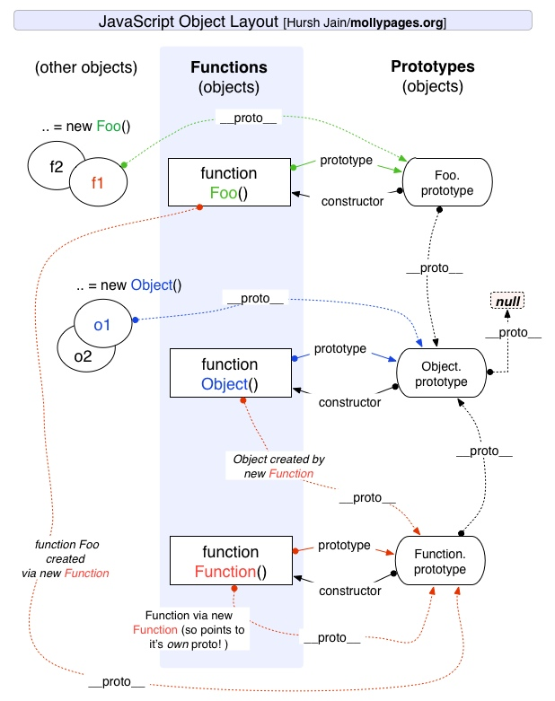

# 物件（Objects）

物件是藉由字串類型的 `key`（property name）來儲存對應的資料，可以建立更複雜、更彈性的實體，所以每種型別之所以能自由使用其擁有的方法，就是透過物件進行包裝來達成的。由物件實字（literal）的 `{}` 或 `new Object()` 建立。

因此會在討論 JavaScript 時聽到：

> Everything is an object.

實際上的意思是：

> Values can behave like objects in JavaScript.

也就是說值的表現（behave）類似物件，但是不代表值的原始型別就是物件（object）。

更明確來說 JavaScript 會隱性將原始值自動裝箱（autoboxing）成物件，讓我們能使用其物件的方法：

```js
var greeting = 'Hello JS';
console.log('型別：', typeof greeting);
console.log('是否為字串物件？', greeting instanceof String);
console.log('卻可以用 String 的方法！', greeting.split(''));
```

執行結果：

```bash
> 型別： string
> 是否為字串物件？ false
> 卻可以用 String 的方法！ (8) ['H', 'e', 'l', 'l', 'o', ' ', 'J', 'S']
```

換成以 String Object 的方式宣告：

```js
var greeting = new String('Hello JS');
console.log('型別：', typeof greeting);
console.log('是否為字串物件？', greeting instanceof String);
console.log('自然可使用 String 的方法->', greeting.split(''));
```

執行結果：

```bash
> 型別： object
> 是否為字串物件？ true
> 自然可使用 String 的方法-> (8) ['H', 'e', 'l', 'l', 'o', ' ', 'J', 'S']
```

自動裝箱（autoboxing）的小測驗 - 如何改動讓 `type.isString` 印出 `true`？：

```js
var str = 'abc';
var type = typeof str; // 'string'

// (new String(type).length === 6) -> true
if (type.length === 6) {
  type.isString = true; // new String(type).isString = true; 隱性自動裝箱，但沒地方儲存，所以 type 還是保持一樣
}

console.log(type.isString); // undefined
```

.

.

.

.

.

答案 - 顯性讓 `type` 變為 String 物件就可以儲存屬性 `isString`

```js
var str = 'abc';
var type = new String(typeof str); // String { [[PrimitiveValue]]: 'string', length: 6 }

if (type.length === 6) {
  type.isString = true; // String { [[PrimitiveValue]]: 'string', length: 6, isString: true }
}

console.log(type.isString); // true
```

## 建構器（Constructor）和 `new` 運算子（Operator）

物件實字（literal）`{}` 可以創建一個物件，但是當要創建多個相似的物件時，為求方便就需要一個像是工廠般的存在 - 建構器（Constructor）。

一般的函式除了可以被執行外，還能當作建構器使用（Arrow function 除外），為了區別兩者，通常會將函式名稱的開頭用大寫來表示，不過它的本質還是函式，所以會搭配 `new` 來執行。

當函式前面搭配 `new` 執行時，會自動完成幾個步驟：

1. 創建一個新物件，新物件內部的 `[[Prototype]]`（`__proto__`）預設指向這個建構器的原型（prototype），並將新物件賦值給 `this`

2. 函式體內部可以對 `this` 進行操作，比如新增物件的屬性（property）

3. 預設回傳 `this` 的值

看起來像是：

```js
function Car(color, brand) {
  // this = {};  (implicitly)

  this.color = color;
  this.brand = brand;

  // return this;  (implicitly)
}

var car = new Car('black', 'Benz');

console.log(car); // Car {color: 'black', brand: 'Benz'}
```

有無 `new` 的差異：

```js
const a = [String, Number, Boolean, Object, Function, Array].map(
  (constructor) => constructor() // 作為 regular function
);

console.log(a); // ['', 0, false, {…}, ƒ, Array(0)]
```

```js
const b = [String, Number, Boolean, Object, Function, Array].map(
  (constructor) => new constructor() // 作為 constructor function
);
console.log(b); // [String, Number, Boolean, {…}, ƒ, Array(0)]
```

特殊的屬性 `new.target`：

可以在函式裡面判斷函式的執行是否使用了 `new`，如果當成一般函式使用時，它為 `undefined`，反之為自己本身。

```js
function Test() {
  console.log(new.target); // undefined
}

Test();
```

```js
function Test() {
  console.log(new.target === Test); // true
}

new Test();
```

### 建構器（Constructor）的 `return`

通常函式作為建構器不會用到 `return`，因為系統會自動回傳生成的 `this` 物件，但如果用了 `return` 會有以下情況：

- 若 `return` 的值是 Primitive 型別（Number、String、Boolean......），則會被忽略

- 若 `return` 的值是 Reference 型別（Object、Array、Function......），則會取代 `this` 物件

## 物件的方法

### `Object.assign`

React.js 開發可用的 immutable array：

```js
var array = [
  {
    name: 'A',
  },
  {
    name: 'B',
  },
];

var index = 1;
var newArray = Object.assign([...array], { [index]: { name: 'C' } });

console.log(array); // [{ name: 'A' }, { name: 'B' }]
console.log(newArray); // [{ name: 'A' }, { name: 'C' }]
```

### `Object.create`

利用 `null` 沒有 `[[Prototype]]`（`__proto__`）的特性，可以用 `Object.create(null)` 來自訂特殊需求的原型物件。

範例：

```js
var obj1 = Object.create(null);
obj1.num = 1;
console.log(obj1); // { num: 1 }

var obj2 = Object.create(obj1);
console.log(obj2); // { [[Prototype]]: { num: 1} }
```

### 物件轉型之 `valueOf()` 與 `toString()`

當物件需要強制轉型（Coercion）為 Primitive 型別時，有以下幾個步驟：

1. object 若**有**定義 `valueOf()` 則會優先使用，除非 `valueOf()` 返回的值不能轉變為目標類型，才會再執行 `toString()`

2. object 若**沒有**定義 `valueOf()` 則會以 `toString()` 為優先使用

3. 若都沒有 `valueOf()` 和 `toString()` 兩方法，可能導致下方錯誤的發生

由 [Object.create](#objectcreate) 範例可得知 `Object.create(null)` 創建的物件是沒有 `[[Prototype]]` 的，所以自然沒有 Object 的原型方法。

物件是 Reference 型別，觸發隱含轉型為字串，但是沒有 `valueOf()` 或 `toString()` 可使用：

```js
console.log(Object.create(null) + ''); // Uncaught TypeError: Cannot convert object to primitive value
```

如何讓這個判斷時成功執行，印出 success：

```js
if (a == 1 && a == 2 && a == 3) {
  console.log('success!');
}
```

關鍵在於思考如何讓 `a` 在隨著判斷推移改變其值，而 `==` 會觸發隱含轉型（Implicit Coercion），因此可以透過改寫隱含轉型所用到的函式來達成：

```js
// ==============修改此處===============
var a = {
  _current: 0,
  valueOf: function () {
    return ++this._current;
  },
  toString: function () {
    console.log('nothing happens');
  },
};
// ====================================

if (a == 1 && a == 2 && a == 3) {
  console.log('success!');
}
```

假如是 `===` 的情況：

```js
if (a === 1 && a === 2 && a === 3) {
  console.log('success!');
}
```

因為物件 `a` 已經不會觸發隱含轉型了，所以改用 `getter()` 的概念來實現，那麼重點是如何用物件 `a` 的同時發動 `getter()`，但直接在物件 `a` 裡面直接寫入 `getter()` 無法達到題目想要的效果。

除非更改題目的判斷：

```js
// ==============修改此處===============
var a = {
  _current: 0,
  get a() {
    return ++this._current;
  },
};
// ====================================

// 只能改變題目
if (a.a === 1 && a.a === 2 && a.a === 3) {
  console.log('success!');
}
```

於是想到在瀏覽器的全域（global）就是物件 Window，在全域裡宣告的 `var` 變數都會存入 `window` 其中，由此可對 `window` 寫入 `getter()` 以達成目標，但是 `window` 不能用一般方式寫入。

以下 `get a()` 會失效，`window` 無法直接改寫：

```js
// ==============修改此處===============
window = {
  ...window,
  _current: 0,
  get a() {
    return ++this._current;
  },
};
// ====================================

if (a === 1 && a === 2 && a === 3) {
  console.log('success!');
}
```

解決方式是利用 `Object.defineProperty()`：

```js
// ==============修改此處===============
var _current = 0;

Object.defineProperty(window, 'a', {
  get: function () {
    return ++this._current;
  },
});
// ====================================

if (a === 1 && a === 2 && a === 3) {
  console.log('success!');
}
```

<!-- TODO -->

<!--

### Computed Property

### 深拷貝 vs 淺拷貝 （Object.assign、spread syntax、JSON......）

### Object.defineProperty()

### Object.defineProperty() 舉例 in

### Object.create()

### Object.prototype.isPrototypeOf()

-->

<!-- Move to the prototypes' chapter -->

## JavaScript 的「物件」導向

由上面結果可以得知，JavaScript 確實是以「物件」為核心來設計，不過此「物件」並非像 Java、C++ 等透過類別（class）建構出的物件實例（object instance），JavaScript 是原型架構（prototype-based）的語言，所以沒有真正意義上的 class（只是語法糖），而是在每個物件中，利用名為原型（prototype）的物件作為模板來繼承，而原型本身可能也有它的原型，像一條條鏈子相互鏈結，稱之為原型鏈（prototype chain）。

## 原型 （Prototypes）

JavaScript 的物件中（除了 `null`、`undefined`）都隱藏一種特殊屬性 `[[Prototype]]`，它可以指向此物件的原型物件。

雖然 `[[Prototype]]` 是隱藏的，但仍然有些方式可以連結到它，像是 `__proto__`（同時作為 getter 和 setter） 或較正式的 `Object.getPrototypeOf()`；而函式建構式（function constructor）的原型可由該建構式的 `prototype` 來存取。



```js
// Function Constructor
function Person(name) {
  this.name = name;
}

// 可以為 Person 的原型增添方法，讓所有實例共用（一般會把方法寫在 prototype 中，避免重複建立）
Person.prototype.sayHi = function () {
  console.log(`Hi, i am ${this.name}.`);
};

// 建構 Person 的實例
var person = new Person('Jerry');

person.sayHi(); // Hi, i am Jerry.

// instanceof 檢查物件是否為指定的建構式所建立的實體
console.log(person instanceof Person); // true

// person.__proto__ 指向 Person 的原型，也就是 Person.prototype
console.log(person.__proto__ === Person.prototype); // true

// 可以透過 hasOwnProperty 回傳物件本身是否有該屬性
console.log(person.hasOwnProperty('sayHi')); // false

// prop in obj 則檢查整個原型鏈，無論屬性是否可列舉（enumerable）
console.log('sayHi' in person); // true

// 也能使用 for (prop in obj) 來遍歷原型鏈中所有可列舉的屬性
for (prop in person) console.log(prop); // name sayHi

// 所以當 person 找不到 sayHi 時，就會沿著 __proto__ 到 Person 的原型查看
console.log(person.sayHi === person.__proto__.sayHi); // true
```

### 參考

- [MDN - Object initializer](https://developer.mozilla.org/zh-TW/docs/Web/JavaScript/Reference/Operators/Object_initializer)

- [JavaScript Garden](https://bonsaiden.github.io/JavaScript-Garden/#object)

- [[day04] YDKJS (Type) : Value 才有型別，變數沒有](https://ithelp.ithome.com.tw/articles/10217877)

- [MDN - getter](https://developer.mozilla.org/zh-TW/docs/Web/JavaScript/Reference/Functions/get)
